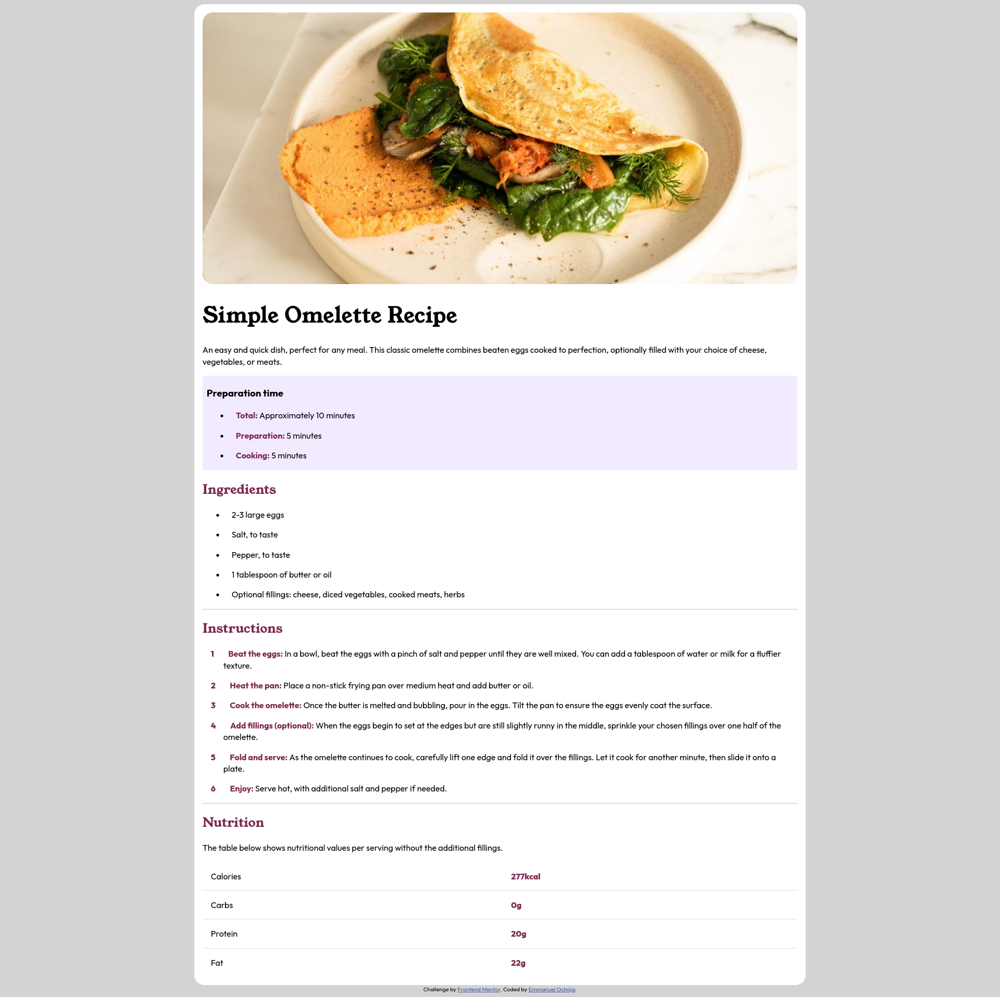

# Frontend Mentor - Recipe page solution

This is a solution to the [Recipe page challenge on Frontend Mentor](https://www.frontendmentor.io/challenges/recipe-page-KiTsR8QQKm). Frontend Mentor challenges help you improve your coding skills by building realistic projects. 

## Table of contents

- [Overview](#overview)
  - [The challenge](#the-challenge)
  - [Screenshot](#screenshot)
  - [Links](#links)
- [My process](#my-process)
  - [Built with](#built-with)
  - [What I learned](#what-i-learned)
- [Author](#author)

## Overview
This is a simple menu website for making an Omelette, I used HTML and CSS only in builing the site.

### Screenshot

### Links

- Solution URL: [solution page](https://www.frontendmentor.io/solutions/using-html-and-css-sY0WuIpLeJ)
- Live Site URL: [Omelette website](https://airme1.github.io/omelette/)

## My process
- I started by writing the HTML for the site to give it a good structure
- After writing the HTML I began styling the webpage using CSS

### Built with

- Semantic HTML5 markup
- CSS custom properties
- Desktop-first workflow

### What I learned

I learned how to properly use the pseudo properties: specifically the '::before' property

## Author

- Github - [github] (https://github.com/Airme1)
- Frontend Mentor - [@Airme1] (https://www.frontendmentor.io/profile/Airme1)

